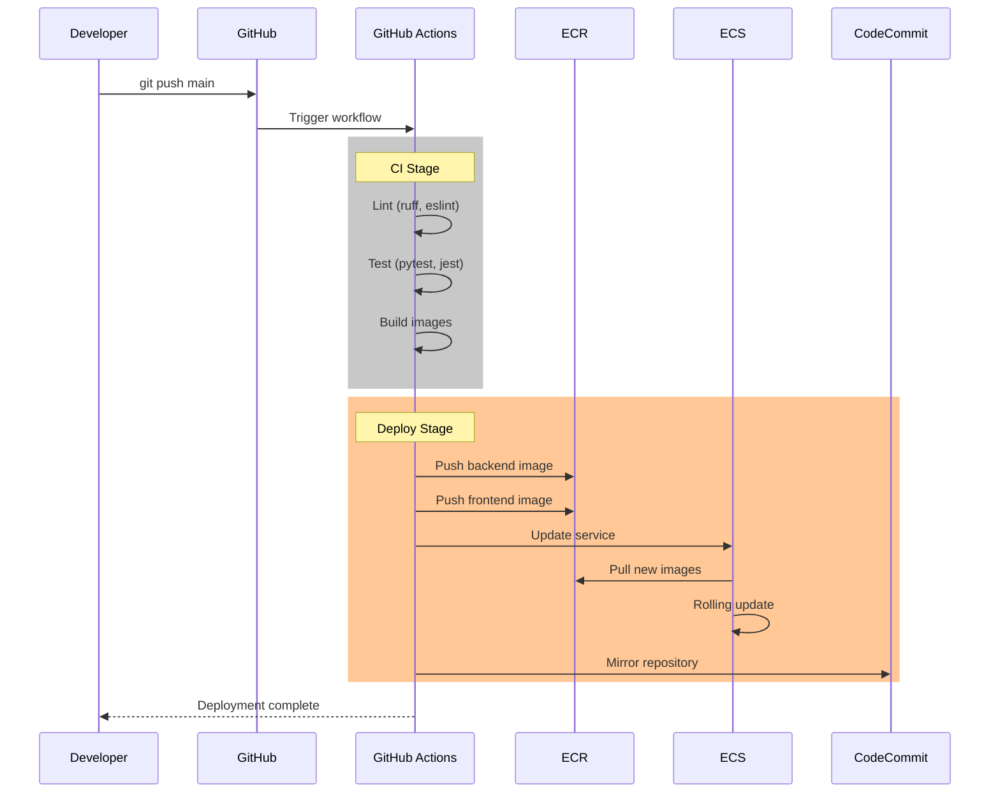

# Arquitetura do ChatGepeto

## Visão Geral

ChatGepeto é um assistente educacional inteligente que utiliza RAG (Retrieval-Augmented Generation) para responder perguntas baseado em documentos. A arquitetura segue princípios de cloud-native design com containerização e orquestração na AWS.

## Diagrama de Arquitetura

```mermaid
flowchart TB
    subgraph "Developer"
        DEV[Developer]
    end

    subgraph "GitHub"
        GH[GitHub Repository]
        GHA[GitHub Actions]
    end

    subgraph "AWS CodeCommit"
        CC[CodeCommit Repo]
    end

    subgraph "AWS - us-east-1"
        subgraph "ECR"
            ECR_BE[ECR Backend]
            ECR_FE[ECR Frontend]
        end

        subgraph "VPC - 10.0.0.0/16"
            subgraph "Public Subnets"
                ALB[Application Load Balancer]

                subgraph "ECS Fargate Cluster"
                    subgraph "Task"
                        BE[Backend Container<br/>Flask:8000]
                        FE[Frontend Container<br/>Next.js:3000]
                    end
                end
            end
        end

        CW[CloudWatch Logs]
        SSM[SSM Parameter Store]
    end

    subgraph "External Services"
        GROQ[Groq API<br/>LLM Provider]
    end

    subgraph "Users"
        USER[End Users]
    end

    %% Developer flow
    DEV -->|git push| GH
    GH -->|trigger| GHA
    GHA -->|build & push| ECR_BE
    GHA -->|build & push| ECR_FE
    GHA -->|update service| ECS Fargate Cluster
    GHA -->|mirror| CC

    %% ECR to ECS
    ECR_BE -.->|pull image| BE
    ECR_FE -.->|pull image| FE

    %% User flow
    USER -->|HTTP:80| ALB
    ALB -->|/api/*| BE
    ALB -->|/*| FE

    %% Backend connections
    BE -->|logs| CW
    BE -->|secrets| SSM
    BE -->|LLM calls| GROQ
    FE -->|API calls| BE

    %% Styling
    classDef aws fill:#FF9900,color:#000
    classDef github fill:#24292e,color:#fff
    classDef container fill:#0db7ed,color:#fff

    class ECR_BE,ECR_FE,ALB,CW,SSM,CC aws
    class GH,GHA github
    class BE,FE container
```

## Componentes

### 1. CI/CD Pipeline

| Componente | Descrição |
|------------|-----------|
| **GitHub** | Repositório principal do código fonte |
| **GitHub Actions** | Pipelines de CI/CD (lint, test, build, deploy) |
| **CodeCommit** | Mirror do repositório para AWS |

### 2. Container Registry

| Componente | Descrição |
|------------|-----------|
| **ECR Backend** | Imagens Docker do Flask backend |
| **ECR Frontend** | Imagens Docker do Next.js frontend |

### 3. Compute (ECS Fargate)

| Componente | Descrição |
|------------|-----------|
| **ECS Cluster** | Orquestração de containers |
| **Task Definition** | Define containers backend + frontend |
| **Service** | Garante disponibilidade e scaling |

### 4. Networking

| Componente | Descrição |
|------------|-----------|
| **VPC** | Rede isolada (10.0.0.0/16) |
| **Subnets** | 2 públicas em AZs diferentes |
| **ALB** | Load balancer com path-based routing |
| **Security Groups** | Firewall rules (80, 443, 8000, 3000) |

### 5. Observability

| Componente | Descrição |
|------------|-----------|
| **CloudWatch Logs** | Centralização de logs |
| **CloudWatch Alarms** | Alertas de CPU/Memory |
| **CloudWatch Dashboard** | Métricas visuais |

### 6. Security

| Componente | Descrição |
|------------|-----------|
| **IAM Roles** | Least privilege para ECS tasks |
| **SSM Parameter Store** | Secrets (API keys) |
| **Security Groups** | Network isolation |

## Fluxo de Deploy



## Decisões Técnicas

### Por que Fargate?
- **Serverless**: Sem gerenciamento de EC2
- **Custo**: Pay-per-use, ideal para workloads variáveis
- **Scaling**: Fácil auto-scaling

### Por que ALB?
- **Path-based routing**: /api/* → backend, /* → frontend
- **Health checks**: Monitora containers
- **TLS termination**: Suporte futuro a HTTPS

### Por que Multi-stage Docker?
- **Imagem menor**: Remove build tools do runtime
- **Segurança**: Menos superfície de ataque
- **Cache**: Builds mais rápidos

### Por que Terraform?
- **IaC**: Infraestrutura versionada
- **Reprodutibilidade**: Mesmo resultado em qualquer ambiente
- **Modularidade**: Fácil de expandir

## Estimativa de Custos (us-east-1)

| Recurso | Especificação | Custo Estimado/Mês |
|---------|---------------|-------------------|
| ECS Fargate | 0.5 vCPU, 1GB RAM | ~$15-20 |
| ALB | 1 LCU avg | ~$16 |
| ECR | 2 repos, <1GB | ~$1 |
| CloudWatch | 7 dias retention | ~$1 |
| Data Transfer | <10GB out | ~$1 |
| **Total** | | **~$35-40/mês** |

*Nota: Custos podem variar. Use AWS Calculator para estimativas precisas.*

## Melhorias Futuras

1. **HTTPS**: Certificado SSL via ACM
2. **RDS**: PostgreSQL gerenciado
3. **ElastiCache**: Redis para cache/sessions
4. **Auto-scaling**: Baseado em métricas
5. **WAF**: Proteção contra ataques
6. **Route53**: DNS customizado
